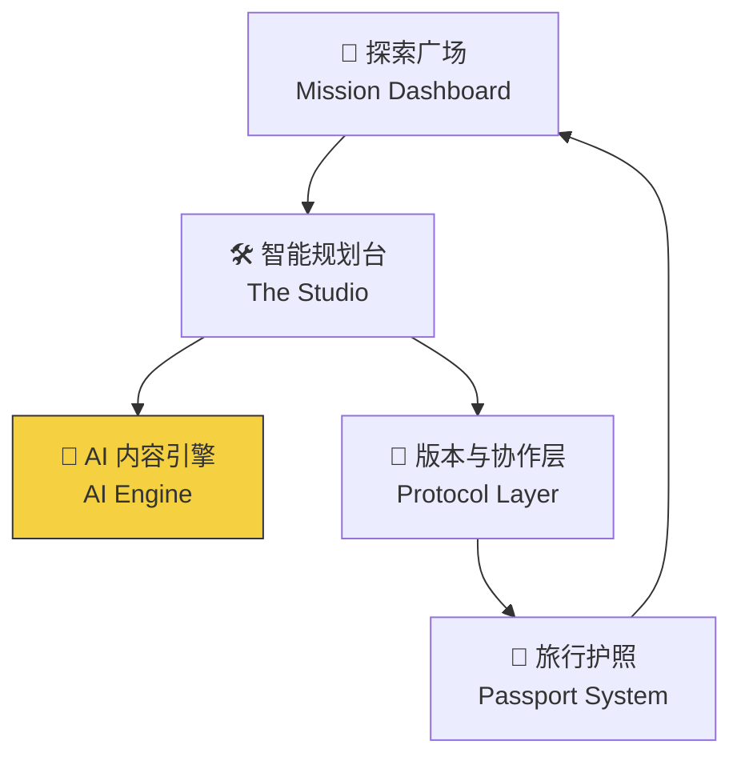

# Project Atlas 改进版开发规划书 V2.0

**定位：** 下一代旅行共创平台 —— 让攻略从"看完就忘的文章"变成"拿来就用的行程"

> [!NOTE]
> 本文档为原 V1.0 规划书的改进版。所有标注 `[改进]` 的部分为新增或修改内容，方便对照原版查看差异。

---

## 1. 项目愿景与痛点分析

### 1.1 市场痛点 （保持原版）

- **非结构化数据：** 用户无法直接"使用"攻略，需人工提取地点、查询路线、核对营业时间
- **信息静态化：** 攻略发布后成"死文档"，店铺倒闭、票价调整无法实时更新
- **缺乏逻辑关联：** 只有地点罗列，缺乏时空逻辑（交通耗时、游览顺序）

### 1.2 `[改进]` 新增痛点

| 痛点 | 说明 |
|---|---|
| **内容创建门槛高** | 制作结构化攻略比写图文日记复杂得多，创作者动力不足 |
| **费用不透明** | "大概花多少钱"是用户最常问的问题，现有平台缺乏系统化的费用管理 |
| **离线不可用** | 山区、地铁、偏远景区等无信号场景极其常见，行程必须支持离线查看 |
| **多人协作难** | 旅行通常是多人同行，缺乏同行者之间协同规划的工具 |

### 1.3 产品解决方案

`[改进]` 保留"旅行版 GitHub"的底层架构思想，但**面向用户的所有界面和术语采用旅行语境包装**：

| 底层概念 | 用户看到的表述 |
|---|---|
| Fork | **"以此为模板"** / "借鉴这个行程" |
| Pull Request | **"提交纠错"** / "我发现了更新" |
| Diff View | **"修改对比"** |
| Merge | **"采纳修改"** |
| Repository | **"行程方案"** |
| Commit | **"保存版本"** |
| Branch | **"备选方案"** |

> [!IMPORTANT]
> **设计原则：** 内部架构100%可以用 Git 思维，但面向用户的每一个文字、按钮、提示都必须是旅行语境的。用户永远不应该看到任何技术术语。

---

## 2. 核心功能架构

平台由五大核心模块组成（`[改进]` 新增 AI 引擎模块）：



---

## 3. 详细功能规划

### 3.1 模块一：探索广场 (Mission Dashboard)

用户进入网站后的第一眼界面，设计目标是**"激发灵感"与"展示成就"**。

#### 全景情报图 (Global Heatmap)
- 基于用户当前位置或兴趣，展示周边的热门行程方案
- 全站足迹热力图，营造活跃社区氛围

#### 趋势榜单
- 以"被借鉴次数"排名，而非点击量（强调实用性）

#### 个人指挥中心
- **数字护照展示：** 用户等级、徽章（"探路者"、"价格捕手"等）
- **任务看板：** 智能推送周边需要更新数据的地点
- **我的行程：** 进行中 / 即将开始 / 草稿箱的行程卡片流

#### `[改进]` 新增功能
- **智能推荐：** 根据用户历史偏好（美食型/打卡型/深度游）推荐匹配度高的行程
- **"有人去过"标签：** 行程卡片上显示最近一位使用者的出行时间，帮用户判断信息时效性

---

### 3.2 模块二：智能规划台 (The Studio)

核心生产力工具——"地图 + 时间轴"双屏交互编辑器。

#### 双屏联动视窗
- **主屏 (Map View)：** 高精度矢量地图，支持缩放浏览
- **底部 (Timeline Flow)：** 弹性时间轴，用户将地点从地图拖入时间轴形成线性计划

#### 智能逻辑引擎
- **自动交通计算：** 两点间自动显示"打车 20min / 地铁 45min"
- **营业时间校验：** 若安排不合理（如夜市放在上午），时间块泛红预警
- **层级嵌套：** 双击大景点（如故宫）展开内部子行程

#### `[改进]` 新增核心功能

**💰 预算管理面板**
- 每个时间块可标注预估费用（门票、餐饮、交通），右上角实时显示日预算和总预算
- 支持按类别（吃 / 住 / 行 / 玩）分类汇总

**🌤️ 天气/季节集成**
- 时间轴顶部显示目的地对应日期的天气预报（接入免费天气 API）
- 节假日/旺季提醒（如"国庆期间该景点预计排队2小时+"）

**📴 离线模式**
- 行程生成后可"下载离线包"，包含所有地点信息、地图截图、导航要点
- 使用 Service Worker + IndexedDB 实现 PWA 离线访问

**👥 多人协作**
- 行程可生成"协作链接"，同行者点击加入后可同时编辑（类似在线文档协作）
- 不需要注册，减少同行者的使用门槛

**📤 一键导出/分享**
- 导出为精美图片（长图海报）、PDF 文档
- 生成微信分享卡片（不需要注册也能查看）

#### `[改进]` 编辑器分阶段实现策略

> [!TIP]
> 虽然不考虑开发时间，但编辑器仍建议分层实现，确保每一层都做到**体验顺滑**后再叠加下一层。

| 层级 | 功能 | 说明 |
|---|---|---|
| 第一层 | 地图打点 + 拖拽排序 + 交通估算 | 核心体验，必须丝滑 |
| 第二层 | 预算标注 + 天气集成 + 营业时间校验 | 实用性增强 |
| 第三层 | 层级嵌套 + 景点内部导览 | 深度体验 |
| 第四层 | 多人实时协作 | 社交场景 |

---

### 3.3 `[改进]` 模块三：AI 内容引擎 (AI Engine)

> [!IMPORTANT]
> 这是改进版中**最核心的新增模块**，解决"内容创建门槛高"和"冷启动"两大难题。

#### 一键生成结构化行程

**用户流程：**
```
粘贴游记文字 → AI 自动提取地点/时间/费用/交通 → 生成可编辑的结构化行程草稿 → 用户微调后发布
```

**支持的输入来源：**
- 小红书笔记文字（复制粘贴）
- 马蜂窝游记文字
- 微信聊天记录 / 备忘录中的碎片化笔记
- 任何自由格式的旅行文字描述

**AI 提取的结构化字段：**
```json
{
  "destination": "成都",
  "duration": "3天2晚",
  "estimated_budget": 2500,
  "days": [
    {
      "day": 1,
      "theme": "市区经典打卡",
      "stops": [
        {
          "name": "春熙路",
          "type": "shopping",
          "time_start": "10:00",
          "duration_hours": 2,
          "cost": 0,
          "tips": "太古里适合拍照",
          "coordinates": [104.0817, 30.6571]
        }
      ]
    }
  ]
}
```

#### 技术方案：推荐 API

| 优先级 | API | 理由 |
|---|---|---|
| 首选 | **DeepSeek API** | 中文理解力强，JSON 输出格式稳定，价格极低（几乎免费） |
| 备选 | **通义千问 (Qwen) API** | 阿里系，有稳定免费额度 |
| 备选 | **智谱 GLM-4 API** | 性价比高，适合作为 fallback |

> **实现要点：**
> - 后端调用 AI API，前端不暴露 API Key
> - 使用精心设计的 System Prompt 确保输出格式一致
> - AI 提取的地点名称自动查询地图 API 匹配坐标，提高准确性
> - 用户始终可以手动修正 AI 结果

#### AI 辅助纠错建议
- 用户提交纠错时，AI 自动判断纠错类型（价格变动 / 关门 / 地址有误），减少用户填写项

---

### 3.4 模块四：社区交互与版本控制 (Social & Versioning)

#### 一键借鉴（原"Smart Fork"）
- 用户点击"以此为模板"，系统生成个人副本
- **修改对比视图：** 直观高亮展示修改了哪些部分

#### 动态预警系统 (The Signal)
- 原作者更新攻略时，向所有借鉴了该攻略且尚未出行的用户发送提醒
- `[改进]` 预警分级：
  - 🔴 **紧急**：店铺永久关闭、景点临时封闭
  - 🟡 **注意**：价格变动、营业时间调整
  - 🔵 **参考**：新增推荐、路线优化

#### `[改进]` 便捷纠错系统

> [!IMPORTANT]
> 纠错必须做到"3秒内完成"，否则用户会放弃反馈。

**设计方案：点击地点 → 弹出快捷纠错面板**

```
┌─────────────────────────────┐
│  📍 武侯祠                  │
│                             │
│  这个地点有什么变化？          │
│                             │
│  [💰 价格变了]  [🚫 关门了]  │
│  [🕐 时间变了]  [📍 位置有误] │
│  [📝 其他补充]               │
│                             │
│  💰 现在的价格：[    ] 元     │ ← 仅点击对应按钮后展开
│  📸 拍张照片佐证 [上传]       │
│                             │
│         [提交纠错]           │
└─────────────────────────────┘
```

**设计要点：**
- 预设高频纠错类型按钮，**一键选择 + 填一个数字 + 可选上传照片**即可完成
- 不需要写长文描述，减少填写负担
- 提交后自动 @ 原作者审核
- `[改进]` **AI 辅助**：如果用户上传了照片，AI 自动识别照片中的价格/营业时间，预填入表单

#### 审核机制
- 原作者收到纠错后，一键"采纳"或"驳回"
- 被多次独立确认的纠错可自动生效（如3位不同用户都报告"已关门"）

---

### 3.5 模块五：共创激励体系 (The Passport)

通过游戏化机制驱动社区活跃与数据更新。保留原版核心设计，增加安全机制。

#### 数字护照
- 记录每一次贡献（纠错、上传照片、创建地点、分享行程）
- 可视化"签证章"系统，代表用户资历
- `[改进]` 护照页面可生成精美分享卡，激发社交传播

#### 领地认领计划 (Territory Guardian)
- 热门区域开放"守护者"申请
- 守护者拥有该区域数据的优先审核权和署名权

`[改进]` **守护者治理机制：**
- **活跃度要求：** 连续30天未活跃的守护者自动降级为"荣誉守护者"（保留称号，收回审核权）
- **信誉评分：** 守护者的审核准确率计入信誉分，低于阈值自动暂停审核权
- **轮换制：** 区域可设置多位守护者共同维护，避免单点失效

#### 赏金任务 (Bounties)
- 针对久未更新的地点，系统自动生成任务
- 用户到达附近时触发，完成获得稀有徽章

`[改进]` **防刷机制：**
- 赏金任务需包含位置验证（GPS 校验）
- 上传照片需通过基础真实性检查（EXIF 时间/位置信息）
- 新用户有冷却期，高频提交触发人工审核

---

## 4. 技术实施策略

### 4.1 推荐技术栈

| 层级 | 技术选择 | 理由 |
|---|---|---|
| **前端框架** | Vue 3 + Vite | 中文生态好，组件库丰富 |
| **UI 组件** | Element Plus 或 Naive UI | 适合后台型+展示型混合场景 |
| **地图引擎** | 高德地图 JS API | 国内合规，数据准确，GCJ-02 坐标系 |
| **时间轴编辑** | 自研组件（基于 drag & drop API） | 需高度定制，无合适开源方案 |
| **后端框架** | Flask 或 FastAPI (Python) | 方便调用 AI API，开发迅速 |
| **数据库** | PostgreSQL + PostGIS | 天然支持地理空间查询 |
| **AI 接口** | DeepSeek API（主）+ Qwen API（备） | 免费/低成本，中文能力强 |
| **实时通信** | WebSocket (Socket.IO) | 多人协作、实时通知 |
| **离线支持** | PWA + Service Worker + IndexedDB | 不需要原生 App 即可离线 |

### 4.2 地图数据策略
- 统一使用高德地图 API（GCJ-02 坐标系，国内合规）
- 高德路线规划 API 提供交通时间估算（驾车/公交/步行）
- 高德 POI 搜索 API 辅助地点坐标匹配与营业信息获取

### 4.3 部署策略
- **初期：** 本地服务器 + Cloudflare Tunnel 对外暴露
- **代码架构预留：** 对象存储接口（随时可迁移至云端 OSS）
- **静态加速：** 前端资源走 CDN

### 4.4 [改进] 用户隐私保障体系

> [!IMPORTANT]
> 用户隐私是社区信任的基石。即使初期规模小，也必须从架构层面考虑隐私保护，避免后期重构。

#### 4.4.1 数据最小化原则

| 数据类型 | 收集策略 | 说明 |
|---|---|---|
| 手机号 | 仅用于验证登录，**脱敏存储**（仅存哈希） | 不作为社交展示 |
| 昵称/头像 | 用户自定义，**不要求实名** | 社区内唯一可见身份 |
| 位置信息 | **仅在用户主动触发时获取**（如打卡、赏金任务），不后台持续定位 | 用户可随时关闭 |
| 行程数据 | 默认**私有**，用户主动发布后才公开 | 草稿箱行程仅自己可见 |
| 浏览记录 | 仅用于推荐算法，**不对外展示** | 不显示"谁看过你的行程" |

#### 4.4.2 数据存储安全
- **密码/手机号：** 使用 bcrypt 加盐哈希，数据库中不存储明文
- **敏感数据加密：** 用户私有行程数据使用 AES-256 加密存储
- **数据库访问：** 最小权限原则，应用层通过参数化查询防止 SQL 注入
- **传输加密：** 全站 HTTPS（通过 Cloudflare Tunnel 自动实现）

#### 4.4.3 用户隐私控制面板

用户可在个人设置中自主控制隐私级别：
- **位置权限：** 仅打卡时使用 / 允许推送附近任务 / 完全关闭
- **行程可见性默认值：** 公开 / 仅关注者 / 私有
- **护照/徽章展示：** 公开 / 隐藏
- **数据导出与删除：** 一键导出个人数据 / 注销并删除所有数据

#### 4.4.4 第三方数据安全
- **AI API 调用：** 用户粘贴的游记文字仅用于即时处理，不在 AI 服务商侧留存（使用不保留数据的 API 模式）
- **地图 API：** 仅发送地点关键词查询，不发送用户身份信息
- **照片上传：** 自动剥离 EXIF 中的敏感信息（如精确 GPS），仅保留验证所需的模糊位置

#### 4.4.5 合规要求
- 符合《个人信息保护法》的数据收集告知义务
- 用户首次使用时弹出简洁的隐私协议，明确告知数据用途
- 提供"一键导出个人数据"与"注销并删除所有数据"功能
- 基础关键词过滤 + 用户内容举报机制，确保内容合规

---

## 5. 开发路线图 (Roadmap)

### 第一阶段：核心构建 (The Foundation) — M1

**目标：** 博主可使用 AI 生成并发布"可交互攻略"，粉丝可浏览和借鉴

| 功能 | 具体内容 |
|---|---|
| AI 内容引擎 | 粘贴文字 → 结构化行程生成 |
| 地图引擎 | 缩放、打点、路径连线 |
| 时间轴编辑器 | 拖拽排序、交通时间估算、预算标注 |
| POI 数据库 | 层级结构（城市-景区-子景点） |
| 用户系统 | 注册登录 + 基础 Dashboard |
| 移动端浏览 | 响应式布局，手机端行程浏览体验优化（当前迭代暂缓，待恢复排期） |

---

### 第二阶段：社区互动 (The Interaction) — M2

**目标：** 开放粉丝互动，实现借鉴、纠错、预警闭环

| 功能 | 具体内容 |
|---|---|
| 一键借鉴 | 模板复制 + 自由修改 |
| 修改对比 | 差异高亮展示 |
| 便捷纠错 | 快捷面板 + AI 辅助 |
| 动态预警 | 分级通知系统 |
| 天气集成 | 时间轴天气预报数据 |
| 多人协作 | 协作链接 + 实时编辑 |
| 一键导出 | 图片/PDF/微信分享 |

---

### 第三阶段：生态完善 (The Ecosystem) — M3

**目标：** 引入游戏化体系，激活社区自动维护数据

| 功能 | 具体内容 |
|---|---|
| 数字护照 | 徽章系统 + 可分享护照页 |
| 领地认领 | 守护者申请 + 治理机制 |
| 赏金任务 | 自动生成 + GPS 验证 + 防刷 |
| 离线模式 | PWA 离线包下载 |
| 智能推荐 | 基于偏好的行程推荐 |

---

## 6. 与原版 V1.0 的核心差异总结

| 维度 | V1.0 | V2.0 改进版 |
|---|---|---|
| 术语 | 直接使用 Git 术语 | 旅行语境化包装 |
| 内容生产 | 用户手动创建 | **AI 辅助一键生成** |
| 纠错方式 | 未详细设计 | **结构化快捷面板，3秒完成** |
| 预算管理 | 缺失 | 每个节点标注费用，自动汇总 |
| 离线访问 | 缺失 | PWA 离线包 |
| 天气集成 | 缺失 | 时间轴天气预报 |
| 多人协作 | 缺失 | 协作链接，无需注册 |
| 导出分享 | 缺失 | 图片/PDF/微信卡片 |
| 移动端 | M3 再优化 | **当前按 Web-only 执行，移动端能力暂缓到后续里程碑** |
| 守护者机制 | 无治理设计 | 活跃度要求 + 信誉评分 + 自动卸任 |
| 防刷机制 | 无 | GPS 验证 + 照片真实性 + 冷却期 |
| 用户隐私 | 仅提及手机号验证 | **完整隐私体系：数据最小化 + 加密存储 + 隐私控制面板 + 合规** |
| 国际化 | 国内+海外双地图 | **聚焦中国大陆，统一高德地图** |
